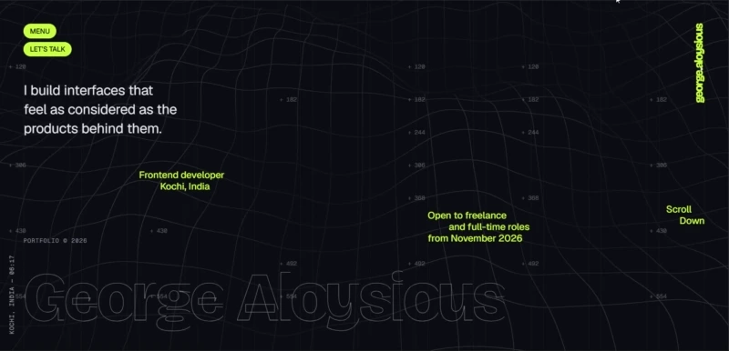

# George Aloysious - Portfolio

Personal portfolio showcasing selected projects, frontend work, and interactive web experiences.

Built with a focus on expressive typography, motion, WebGL, accessibility, and responsive interaction.

### [View Live Portfolio →](https://aloysious.dev)



---

## About

This portfolio is designed as an interactive experience rather than a traditional static portfolio.

It combines editorial typography, scroll-driven animation, custom page transitions, responsive WebGL effects, and project-focused storytelling while maintaining accessibility and graceful fallbacks across different devices.

---

## Tech Stack

- **React**
- **Vite**
- **Tailwind CSS**
- **GSAP**
- **ScrollTrigger**
- **SplitText**
- **Lenis**
- **Three.js**
- **React Three Fiber**
- **Headless UI**
- **Resend**
- **Google reCAPTCHA v3**
- **Vercel**

---

## Highlights

### Interactive WebGL Background

A Three.js wire terrain runs behind the site and reacts to pointer movement, touch interaction, clicks, and scroll position.

The effect is automatically disabled when WebGL is unavailable, reduced motion is enabled, Save-Data is active, or the device does not meet the required capabilities.

### Project Transitions

Project cards transition into their detail pages using a custom WebGL shader animation.

If WebGL is unavailable, the site falls back to a GSAP-powered image expansion.

Reduced-motion users receive a simplified fade transition.

### Scroll & Animation System

Lenis smooth scrolling is synchronized with GSAP and ScrollTrigger so scroll-based animations remain consistent throughout the site.

Animations are scoped and cleaned up during route changes to prevent stale timelines and ScrollTriggers.

### Responsive Motion

The animation system adapts based on device capabilities and user preferences.

When `prefers-reduced-motion` is enabled, the site disables:

- Smooth scrolling
- Parallax
- Custom cursor effects
- Magnetic interactions
- WebGL effects
- Scrambled text
- 3D rollers

Touch devices also receive simplified interactions where pointer-specific effects are not appropriate.

### Accessibility

The portfolio includes:

- Semantic page landmarks
- Skip navigation
- Keyboard navigation
- Visible focus states
- Reduced-motion support
- Accessible modal focus management
- Accessible form validation
- Screen-reader-friendly animated text
- WCAG AA text contrast

---

## Pages

The site includes:

- **Home**
- **About**
- **Projects**
- **Project Details**
- **Contact**
- **404**

---

## Project Structure

```text
src/
├── components/
│   ├── ui/
│   ├── layout/
│   └── animations/
├── pages/
├── sections/
├── hooks/
├── utils/
├── styles/
├── config/
├── data/
├── App.jsx
└── main.jsx

public/
├── images/
├── models/
├── videos/
├── fonts/
└── favicon.ico

api/
└── verify-and-send.js
```

Portfolio content is primarily managed through:

```text
src/config/siteConfig.js
src/data/projects.json
src/data/testimonials.json
```

---

## Local Development

Requires **Node.js 20+**.

```bash
git clone https://github.com/Aloysious-Kalathil/Portfolio.git
cd Portfolio

npm install
cp .env.example .env
npm run dev
```

The local development server runs at:

```text
http://localhost:5173
```

Create and preview a production build with:

```bash
npm run build
npm run preview
```

---

## Environment Variables

Create a `.env` file based on `.env.example`.

```env
VITE_RECAPTCHA_SITE_KEY=
RECAPTCHA_SECRET_KEY=
RECAPTCHA_MIN_SCORE=0.5

RESEND_API_KEY=
CONTACT_TO_EMAIL=
CONTACT_FROM_EMAIL=
```

Only variables prefixed with `VITE_` are exposed to the browser.

Sensitive values such as the reCAPTCHA secret and Resend API key remain server-side.

---

## Contact Form

The contact form uses:

**reCAPTCHA v3 → Vercel serverless function → Resend**

The backend endpoint:

```text
/api/verify-and-send
```

is handled by:

```text
api/verify-and-send.js
```

The serverless function:

1. Validates submitted fields
2. Checks the honeypot field
3. Verifies the reCAPTCHA token
4. Validates the expected action and minimum score
5. Sends the message through Resend
6. Uses the visitor's email as the reply-to address

Secrets are never exposed to the client.

---

## Performance

The site includes several performance-focused optimizations and fallbacks:

- Lazy-loaded routes
- Lazy-loaded project imagery
- Responsive AVIF and WebP images
- Deferred WebGL initialization
- WebGL capability detection
- `Save-Data` awareness
- Reduced effects on lower-capability devices
- Animation cleanup during route changes

---

## SEO

Each page includes its own:

- Page title
- Meta description
- Canonical URL
- Open Graph metadata

The project also generates:

```text
robots.txt
sitemap.xml
```

using the configured production site URL.

---

## Deployment

The portfolio is deployed on **Vercel**.

Vercel handles both the frontend deployment and the serverless contact endpoint:

```text
api/verify-and-send.js
```

The contact form sends email through **Resend**.

Before deploying, configure the required variables from `.env.example` in:

**Vercel → Project Settings → Environment Variables**

The production flow is:

```text
Visitor
   ↓
React Portfolio
   ↓
reCAPTCHA v3
   ↓
Vercel Serverless Function
   ↓
Resend
   ↓
Email
```

---

## Design & Motion

The visual system is built around:

- Bricolage Grotesque
- Geist
- Geist Mono
- Editorial-scale typography
- Dark and light themes
- Accent-driven interaction states
- Scroll-scrubbed movement
- Masked text reveals
- Scrambled text transitions
- 3D service rollers
- Interactive WebGL terrain
- Shader-based project transitions

Motion primarily uses `expo.out` and `power4.inOut` easing to keep interaction consistent across the site.

---

## License

The source code is available for reference and learning.

The portfolio's personal content, branding, design assets, project imagery, and written material should not be copied or redistributed as someone else's work.
